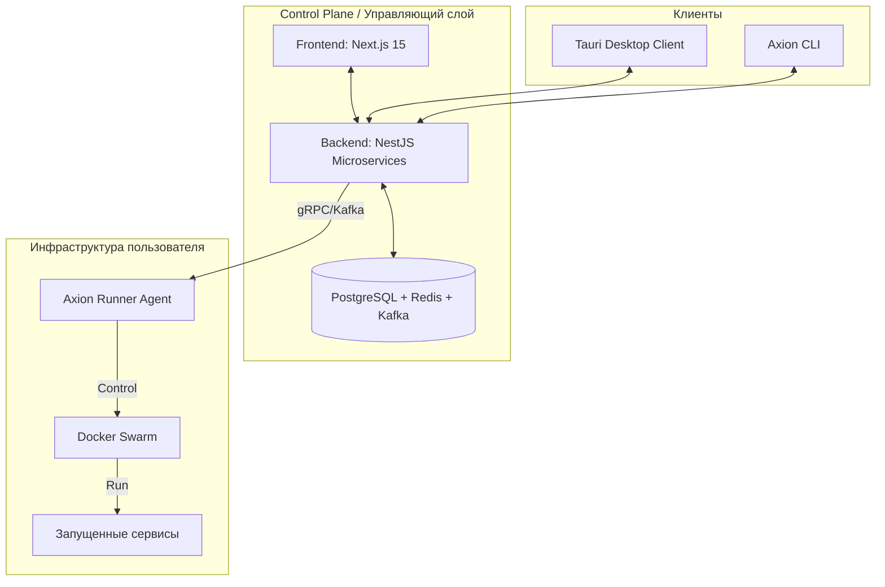

# Обзор Архитектуры

Архитектура Axion разделена на три изолированных контура взаимодействия: **Control Plane** (Управляющий слой), **Clients** (Клиентские приложения) и **User Infrastructure** (Инфраструктура пользователя).

## Компоненты системы

---

## 1. Axion Control Plane

Центральный управляющий слой, реализованный как набор микросервисов на **NestJS**. Обеспечивает координацию всех процессов платформы.

- **Graph Service**: Отвечает за хранение графов, версионирование и синхронизацию состояния (CRDT/SSE).
- **Codegen Service**: Оркестратор генерации кода. Анализирует граф, применяет Blueprints, генерирует структуру и вызывает LLM для бизнес-логики.
- **Deployment Service**: Планировщик задач развертывания. Управляет очередями BullMQ и отправляет команды агентам.
- **Infrastructure Service**: Управление реестром серверов, SSH-ключами и мониторинг ресурсов кластеров.
- **Billing Service**: Учет потребления ресурсов и биллинг.

## 2. Клиентские приложения

Интерфейсы для взаимодействия с платформой.

### Веб-клиент

Основной инструмент для управления облачными проектами.

- **Стек**: Next.js 15 (App Router), React 19, React Flow.
- **Функции**: Визуальный редактор, командная работа, дашборд мониторинга.

### Desktop Client (Tauri)

Нативное приложение для локальной разработки.

- **Особенности**: Работает без интернета, использует локальный Docker, хранит данные в SQLite.
- **Связь**: Взаимодействует с локальным агентом через Unix Sockets.

## 3. Инфраструктура пользователя

Среда исполнения сгенерированных сервисов. Axion не хостит код пользователей на своих мощностях — он управляет серверами пользователя.

### Axion Runner Agent

Системный сервис (Daemon) на Rust, устанавливаемый на серверы.

- **Протокол**: gRPC (команды) + Kafka (поток данных).
- **Задачи**:
  - Управление Docker Swarm (deploy, scale, update).
  - Сбор телеметрии (CPU/RAM, логи контейнеров).
  - Проксирование трафика (при необходимости).

### Изоляция

Каждый проект разворачивается в изолированном namespace:

- Отдельная Docker Network.
- Лимиты ресурсов (cgroups).
- Изолированные тома данных (Volumes).
