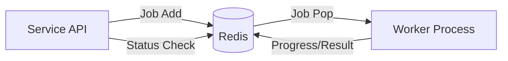

# Фоновые Задачи (BullMQ)

Axion использует очереди сообщений для выполнения длительных операций, которые нельзя выполнить в рамках синхронного HTTP-запроса.

## Архитектура очередей



## Основные очереди

| Очередь | Назначение | Примеры задач |
| :--- | :--- | :--- |
| **deployment** | Управление деплоем | `build-image`, `deploy-stack`, `rollback` |
| **codegen** | Генерация кода | `generate-project`, `validate-graph` |
| **agent** | Управление агентами | `install-agent`, `upgrade-agent`, `restart-agent` |
| **email** | Уведомления | `send-welcome`, `send-invoice` |

## Конфигурация воркеров

### Retry Policy (Политика повторов)
Для задач, зависящих от внешних факторов (сеть, SSH-соединение), обязательно настраиваются повторы.

```typescript
// Конфигурация задачи
{
  attempts: 5,
  backoff: {
    type: 'exponential',
    delay: 2000 // 2s, 4s, 8s, 16s, 32s
  },
  removeOnComplete: true // Очистка Redis от успешных задач
}
```

### Graceful Shutdown
Воркеры должны корректно обрабатывать остановку сервиса:
1.  Перестать брать новые задачи.
2.  Дождаться завершения текущих задач (или вернуть их в очередь).
3.  Закрыть соединение с Redis.

## Мониторинг

Для отслеживания состояния очередей используются метрики:
*   `bull_jobs_active`: Задачи в работе.
*   `bull_jobs_waiting`: Длина очереди (Lag).
*   `bull_jobs_failed`: Количество ошибок.

> **Best Practice**: Если количество `failed` задач растет, необходимо проверить логи воркеров и, возможно, поставить очередь на паузу до устранения инцидента.
