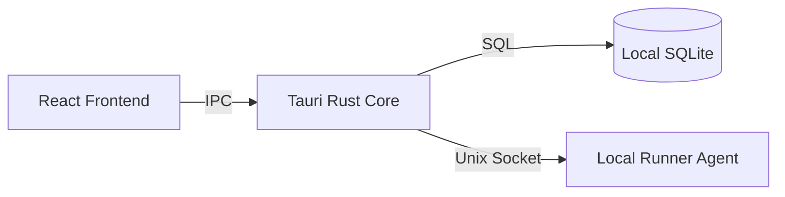

# Tauri Client (Internals)

Axion Tauri Client — это нативное приложение для локальной разработки, предоставляющее доступ к полному функционалу платформы в офлайн-режиме.

## 🏗 Архитектура

Приложение построено на базе Tauri v2 и использует гибридную архитектуру:

*   **Frontend (WebView)**: React 19 + React Flow. Отвечает за рендеринг графа, форм и визуализацию состояния. Работает в системном WebView (WebKit на macOS/Linux, WebView2 на Windows).
*   **Backend (Rust)**: Core-процесс, отвечающий за системные вызовы, работу с файловой системой, встроенную SQLite базу данных и взаимодействие с Docker.

---

## ⚡ Локальный режим (Local-first)

Ключевая особенность десктопного клиента — возможность работы без подключения к Control Plane (SaaS).

1.  **Локальное хранилище**: Все проекты и графы сохраняются в локальную SQLite базу данных (`~/.axion/axion.db`).
2.  **Local Runner**: Клиент автоматически обнаруживает Docker Daemon на хосте и запускает Runner Agent в контейнере.
3.  **Прямая связь**: Взаимодействие с агентом происходит через **Unix Domain Sockets** (на macOS/Linux) или **Named Pipes** (на Windows), минуя сетевой стек.

---

## 🔄 Синхронизация

При наличии интернет-соединения клиент может синхронизировать локальное состояние с облаком:

*   **Incremental Sync**: Передаются только дельты (изменения) графа для экономии трафика.
*   **Conflict Resolution**: Реализован механизм разрешения конфликтов версий (Last Write Wins или ручной выбор).

---

## 🛠 Сборка и безопасность

*   **Размер**: Использование системного WebView позволяет сохранить размер дистрибутива в пределах 15 MB.
*   **Безопасность**: Rust Core обеспечивает изоляцию системных вызовов. Frontend не имеет прямого доступа к файловой системе, все операции проходят валидацию в Rust-слое.
*   **Обновления**: Встроенный механизм автообновления с проверкой цифровых подписей (Ed25519).
